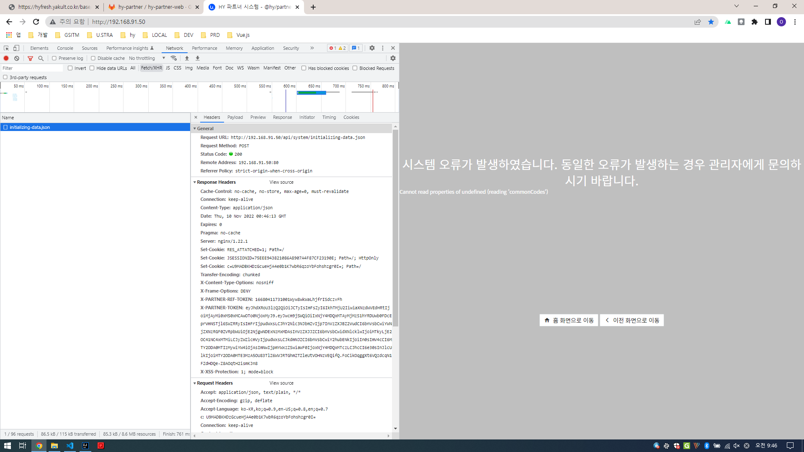
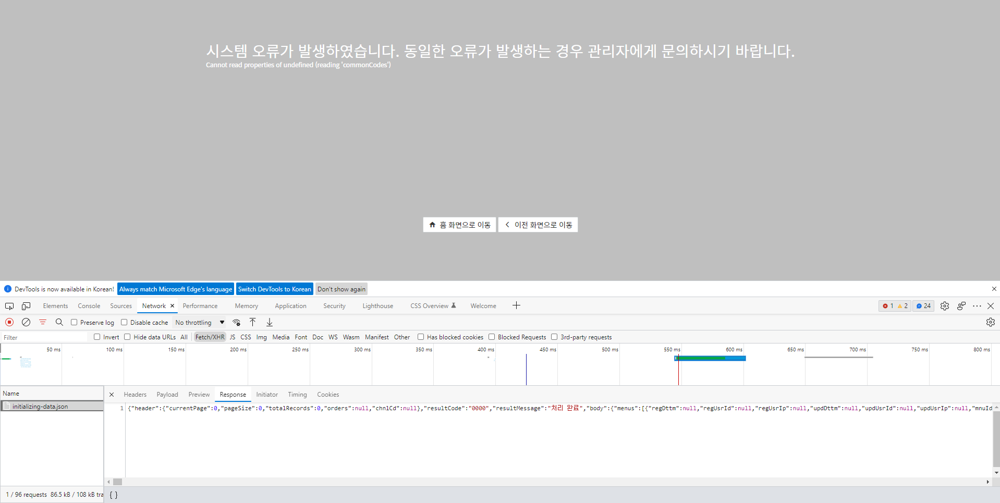
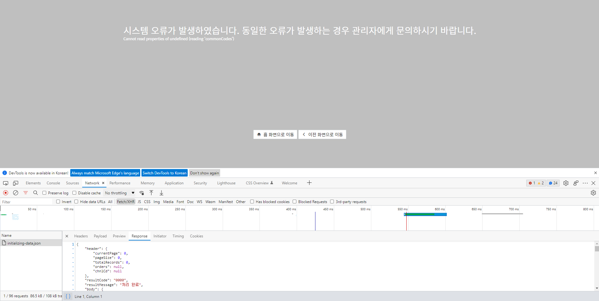

### 크롬 캡쳐

```
크롬 개발자모드(F12) > Toggle device toolbar (Ctrl +Shift + M) >
Dimensions: Responsive 설정 (1000 x 600) > ...버튼 > Capture full size screenshot, Capture screenshot
```

### 크롬 네트워크 설정

```
크롬 개발자모드(F12) > Network tab > Fast 3G, Slow 3G 등 선택
```

### 크롬 인코딩 강제설정

Set Character Encoding 설치
https://chrome.google.com/webstore/detail/set-character-encoding/bpojelgakakmcfmjfilgdlmhefphglae?hl=ko
사용법
브라우저 화면 우클릭 > Set Character Encoding > 인코딩

### 크롬 사이트 또는 앱의 정보 유출 비밀번호 경고 끄기

    설정 > 개인정보 및 보안 > 보안
    데이터 유출로 인해 비밀번호가 노출된 경우 알림 (해제)


### 모바일 크롬 라이브페이지 설정

    chrome://flags
    검색창에 Paint Preview Startup를 입력합니다.
    속성값을 Default에서 Disabled로 변경합니다.
    하단의 Rerunch를 탭 합니다.

### chrome DevTools

    팝업 개발자 모드창 사용 시 F12를 누를 경우 다시 뜸
    개발자모드창 오른쪽일 경우 폰트 사이즈를 75%로 줄이고 1920을 맞추서 사용가능
    Toggle Device Toolbar 사용시 Response에서 1920x1080으로 맞춰서 사용가능

### chrome Responsive 설정

    chrome Responsive 우측 ... 클릭  Add device Type 클릭
    설정항목에서 Desktop으로 변경

### chrome debugger

    Application > Storage > Session Storage
    Network > Fetch/XHR
    Network > Fetch/XHR > Response (하단 {}클릭)







### chrome android debugger
    1. PC에 USB 연결
    2. chrome://inspect/#devices
    3. 연결시 USB 디버깅 등 확인

### chrome web store using offline

```
# 확장프로그램 오프라인 다운로드
1. https://crxextractor.com/ > Let's Start
2. https://chrome.google.com/webstore/detail/selenium-ide/mooikfkahbdckldjjndioackbalphokd?hl=ko 확장 프로그램 입력후 다운로드

# 확장프로그램 설치
1. chrome에서 chrome://extensions/ 이동
2. 확장프로그램 > 개발자모드 온
3. 확장프로그램 추가

```