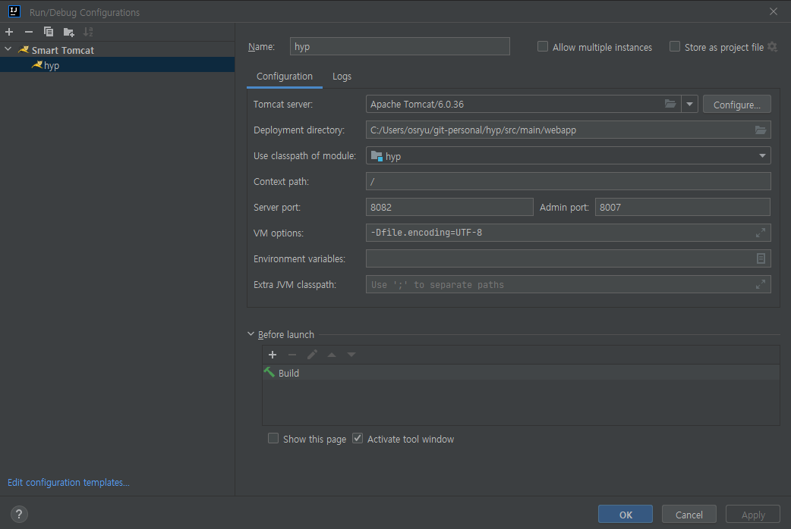

### Project Java version 변경

    Project Structure창 (단축키 : SHIFT+CTRL+ALT+S)
    * Project
    1) SDK 변경                      
    2) Language Level 변경
    * Module
    3) Language Level 변경
    * SDKs
    4) 원하는 JDK를 선택한다(JDK는 한 폴더에 모아두는것을 추천!)

    Project Setting (단축키 : CTRL+ALT+S)
    * Build,Execution,Deployment  -> Build Tools -> Gradle
    5) Gradle JVM 변경
    * Build,Execution,Deployment  -> Compiler -> Java Compiler
    6) Project bytecode version 변경  

### Java SDK 설정
    File > Project Structure 선택

    Project Settings > Project > SDK 클릭 > Add SDK

### 한글깨짐
    Console에서 한글이 깨지는 경우
    Ctrl + Shift + A 단축키 입력 후
    Edit custom VM 입력 후 선택
    -Dfile.encoding=UTF-8 입력후 저장
    IntelliJ 재실행
    * 설치시 Edit Custom VM Options 경로
    C:\Users\{user}\AppData\Roaming\JetBrains\IdeaIC2022.1\idea64.exe.vmoptions

### 한글Encoding 설정
    CTRL + ALT + S 로 IntelliJ Settings 메뉴 호출

    Editor > File Encodings 로 이동

    Global Encoding: UTF-8
    Project Encoding: UTF-8
    Default encoding for properties files: UTF-8 (.properties 파일)
    Transparent native-to-ascii conversion 체크

### Terminal (cmd to git bash)
    File > Settings > Tools > Terminal

    Application Settings > Shell path > 변경후 > OK > IntelliJ 재시작

    변경전 : powershell.exe 
    변경후 : "C:\Program Files\Git\bin\sh.exe" -login -i

### Inlay Hints
    File > Settings > Editor > Inlay Hints > Code vision 체크 해제

### Line Number, Whitespce

    File > Settings > Editor > General > Appearance
    Show line numbers(check)
    Show whitespaces(check)

### Font SizeLine Number

    File > Settings > Editor > General > Change font size with Ctrl + Mouse Wheel (Check)

### jdbc drivers location
    C:\Users\${user}\AppData\Roaming\JetBrains\IntelliJIdea2022.1\jdbc-drivers\Oracle

### plugin Database Navigator

    File > Settings > Plugins > Database Navigator

### Data Source와 SQL Dialect 옵션 해제, 배경색 제외

    File > Settings(Ctrl + Alt + S) > Editor > Inspections > SQL - No data sources configured, SQL dialect detection 체크 해제
    File > Settings(Ctrl + Alt + S) > Editor > Color Scheme > General > Code - Injected language fragment - Background 체크 해제

### mapper 구현체로 이동
    ctrl + alt + b

### 구현체 제외 
    검색시 ctrl + shift + n 사용 (모두를 할경우 전부 나옴)

### Maven Project Setting
    File > Project Structure 
    Project Settings > Project > SDK > 선택 > Apply
    Platform Settings > SDKs > + > Add JDK

    File > Settings
    Build, Execution, Deployment > Build Tools > Maven
    Use settings from .mvn/maven.config 체크해제 > User settings file에서 선택 > Apply

    Run > Edit Configurations
    + > Tomcat Server > local
    
    Deployment Tab > + > Artifact > Select Artifacts to Deploy에서 project명:war exploded 선택
    Application context 설정 /

    Server Tab
    Application server > Tomcat Server > Tomcat Home 설정 > 원하는 톰캣 선택 후 확인
    On 'Update' action: Update classes and resources (핫 리로드옵션 project명:war exploded여야함)
    On frame deactivation: Update classes and resources (핫 리로드옵션 project명:war exploded여야함)
    VM options: -Dfile.encoding=UTF-8
    JRE: 1.7
    Tomcat Server Settings : HTTP port: 8080

### Mybatis Setting
    노란줄이 나타나는 경우
    File > Settings > Languages & Frameworks > SQL Dialects
    Global SQL Dialect: Oracle (자주 사용하는 설정으로)
    Project SQL Dialect: Oracle

### Database
    Database탭 > + > Oracle 선택
    설정 후 Test Connection > Driver 다운로드

### IntelliJ Community Tomcat 설정

    1. smart tomcat 플러그인 추가
    2. Java 설정
        File > Project Structure 
        Project Settings > Project > SDK > 선택 > Apply
        Platform Settings > SDKs > + > Add JDK
    2. Maven 설정
        File > Settings
        Build, Execution, Deployment > Build Tools > Maven
        Use settings from .mvn/maven.config 체크해제 > User settings file에서 선택 > Apply
    3. Edit Configurations
        Run > Edit Configurations
        + > Smart Tomcat

        Tomcat Server: 톰캣 추가
        Deployment directory: ~/project/src/main/webapp
        Use classpath of module: project
        Context path: /

#### intellij Could not initialize class oracle.jdbc.driver.OracleDriver
    ~/project/src/main/webapp/WEB-INF/lib 로 ojdbc6.jar 파일을 넣어서 처리