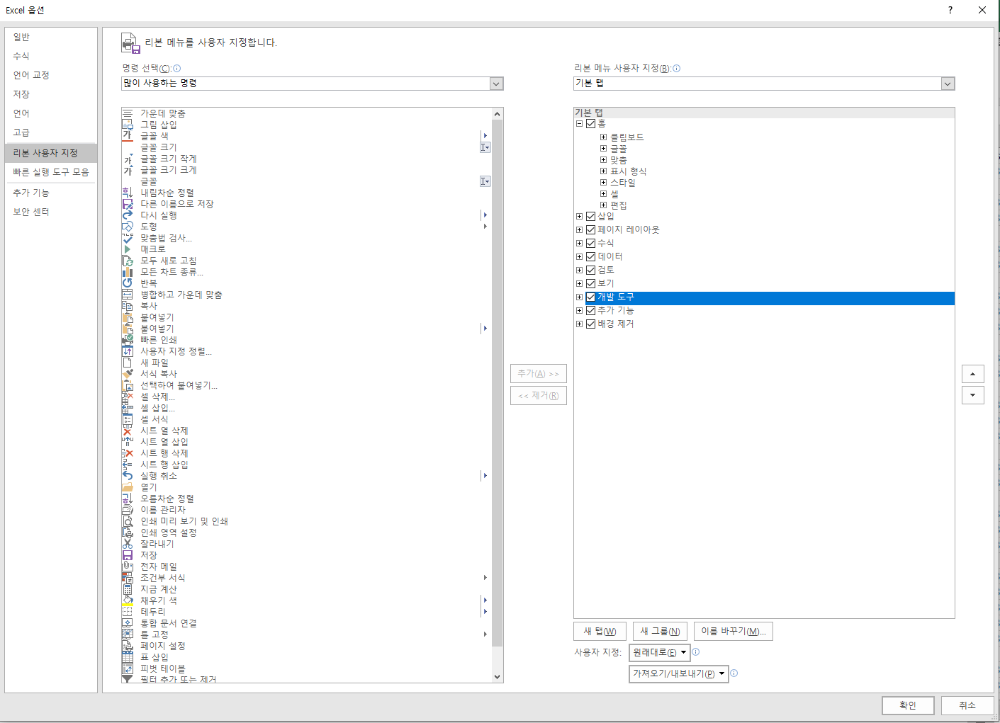
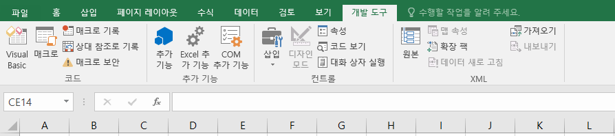
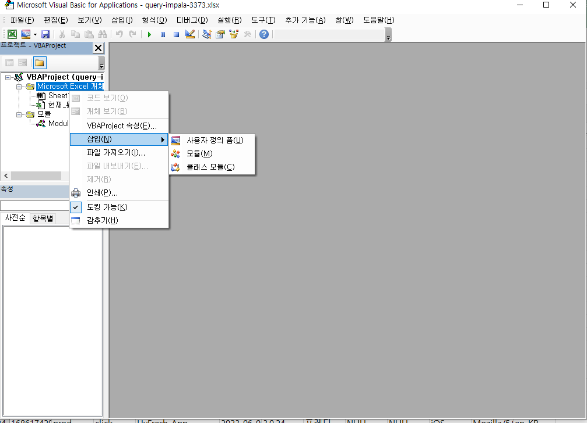

### setting







### 열숨기기 및 사이즈 변경
```
Sub HideAndShowFunction()
    Dim resultMsgBox As VbMsgBoxResult
    resultMsgBox = MsgBox("열을 숨길지 여부 선택", vbOKCancel)

    If resultMsgBox = vbOK Then
        Columns("A:KS").Hidden = True

        arrx = Array("C", "F", "K", "Q", "R", "Y", "Z", "AA", "AZ", "AK", "CG", "CH", "CI", "CO", "CS", "KR", "KS")
        arry = Array("50", "50", "40", "70", "80", "80", "80", "70", "50", "50", "50", "70", "90", "90", "100", "50", "50")
        Dim index As Long

        For index = LBound(arrx) To UBound(arrx)
            Columns(arrx(index)).Hidden = False
            Columns(arrx(index)).ColumnWidth = arry(index) / 5
        Next index

    Else
        Columns("A:KS").Hidden = False
    End If

    ActiveSheet.Cells(1, 1).Select
End Sub
```