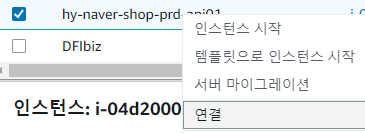
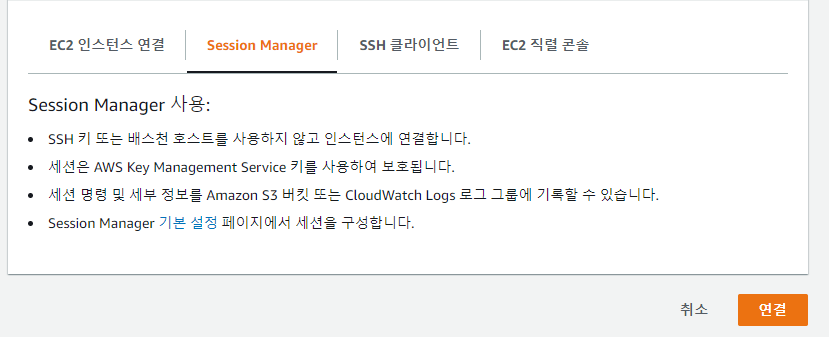

### Setting(Node)

```
curl -sL https://deb.nodesource.com/setup_12.x | sudo -E bash -

sudo apt-get install -y nodejs

node -v
npm -v

cd /

ls

cd opt

pwd

whoami

mkdir myproject
sudo mkdir myproject
ls

ls -al

sudo chown ubuntu:ubuntu myproject

cd myproject
npm install -g nodemon express express-generator
sudo npm install -g nodemon express express-generator

express
ls

 vi package.json
esc -> :q or :wq

cd bin/www
cd bin
vi www
cd ..
npm install
npm start

sudo npm install -g pm2
pm2 start bin/www

pm2 list
pm2 stop 0


## 전체삭제
cd /
cd opt/
rm -rf myproject/*

## mysql

## 입력모드
vi app.js
i
### 수정작업
i 입력 후 수정
완료 후 esc > :wq

### 수정을 안한 경우
esc > :q


##
vi .env

pm2 start server.js


## nginx 설치 및 배포

sudo apt-get install nginx

sudo vi /etc/opt/sources.list

deb http://ap-northeast-2.ec2.archive.ubuntu.com/ubuntu/ xenial main restricted

deb http://ap-northeast-2.ec2.archive.ubuntu.com/ubuntu/ xenial-updates main restricted

deb http://ap-northeast-2.ec2.archive.ubuntu.com/ubuntu/ xenial universe


deb http://nginx.org/packages/ubuntu/ xenial nginx
deb-src http://nginx.org/packages/ubuntu/ xenial nginx

sudo apt-get update
sudo service nginx start
sudo service nginx status

cd /etc/nginx
ls
cd conf.d
ls
sudo vi default.conf

sudo vi /etc/nginx/conf.d/default.conf


server {
    listen 80;
    server_name localhost;
    location / {
        root /usr/share/nginx/html;
        index index.html index.html;
    }
    error_page 500 502 503 504 /50x.html;
    location = /50x.html{
        root /usr/share/nginx/html;
    }
}


변경
server {
    listen 80;
    server_name localhost;
    location / {
        proxy_pass http://127.0.0.1:3000/;
    }
    error_page 500 502 503 504 /50x.html;
    location = /50x.html{
        root /usr/share/nginx/html;
    }
}

sudo service nginx restart
sudo service nginx reload


server {
    listen 80;
    location / {
        proxy_pass http://127.0.0.1:3000/;
    }

    error_page 404 /404.html;
    location = /40x.html {
    }
    error_page 500 502 503 504 /50x.html;
    location = /50x.html {
    }
}

sudo unlink /etc/nginx/sites-enabled/default


vi /etc/nginx/sites-available/reverse-proxy.conf


sudo service nginx stop

## 재배포가 필요한 경우

pm2 stop server
pm2 delete server
pm2 start server.js

sudo service nginx stop
sudo service nginx start
sudo service nginx reload

cd /
cd opt/
rm -rf myproject/*
```

### Setting(SpringBoot)


#### 1. EC2 CentOS 7 인스턴스 생성

```
chmod 400 awskey.pem
ssh -i "awskey.pem" centos@ec2-000-000-000-000.ap-northeast-2.compute.amazonaws.com
```

#### 2. pem key 없이 접속

```
sudo adduser testuser
sudo passwd testuser

sudo chmod u+w /etc/sudoers # 파일 권한 변경

sudo vi /etc/sudoers # 파일 접근

--- sudoers 설정 추가
"유저명" ALL=(ALL:ALL) ALL
---

sudo vi /etc/ssh/sshd_config

--- sshd_config 설정 변경
PasswordAuthentication yes
---

sudo service sshd restart


ssh "유저명"@"IP"
ssh testuser@000.000.000.000

```

### AWS EC2 접근 console에서 접근
원하는 인스턴스 선택 > 우측마우스 > 연결 클릭 > Session Manager에서 연결 클릭
```bash
sh-4.2$ sudo su
```




### References

```
https://wooono.tistory.com/371

```

